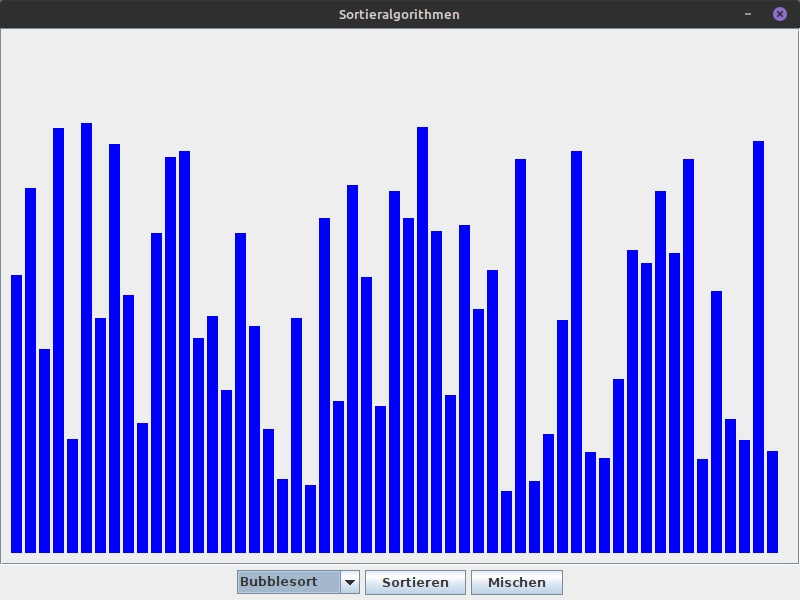

# Sortieralgorithmen
Dieses Projekt dient dazu, Sortieralgorithmen visuell darzustellen.
Die grafische Darstellung ist mithilfe von JavaSwing implementiert.
Die Algorithmen sind in Java implementiert.

### Implementierte Algorithmen

| Algorithmus   | Laufzeit      |
|---------------|---------------|
| Bubblesort    | O(n²)         |
| Selectionsort | O(n²)         |
| Insertionsort | O(n²)         |
| Quicksort | O(n * log(n)) |
| Mergesort | O(n * log(n)) |
| Heapsort | O(n * log(n)) |

### GUI verwenden
Die Algorithmen können über ein Dropdown-Menü ausgewählt werden.
Der "Sortieren"-Knopf startet das Sortieren.
Mit dem "Mischen"-Knopf kann das Sortieren angehalten werden und
die Balken wieder in eine neue zufällige Reihenfolge gebracht werden.
